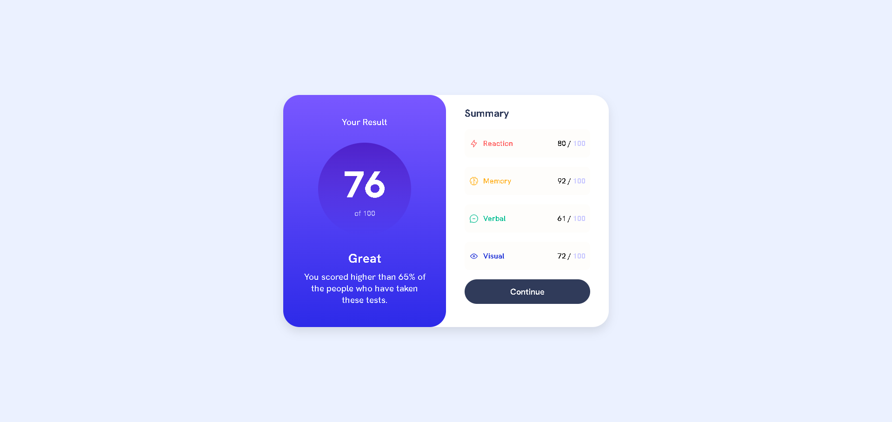

# Results Summary Component

This project is a "Results Summary Component" application developed for [Frontend Mentor](https://www.frontendmentor.io/challenges/results-summary-component-CE_K6s0maV).

## Features

- Results screen and summary section
- Responsive design
- Clean and readable code structure

## Technologies Used

- HTML
- CSS
- JavaScript

## Screenshot

## License

This project is for educational purposes only.
